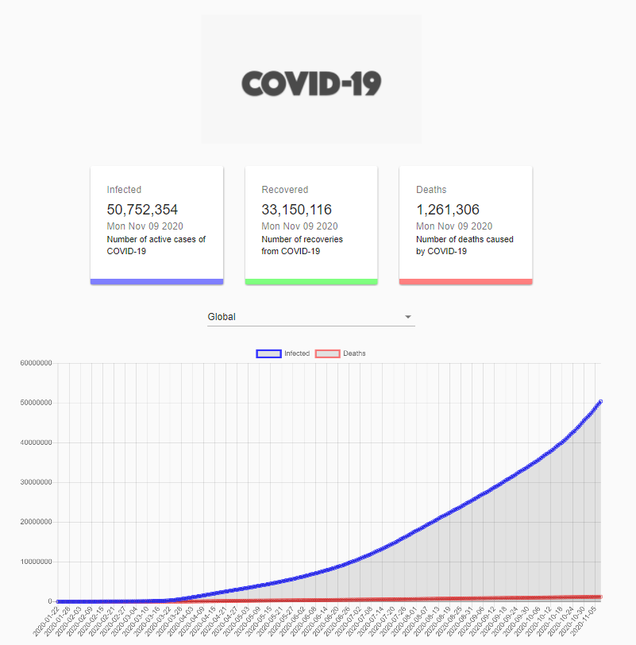

# Corona APP

<p align="center">

</p>

<a href="https://corona-app-timothyboudreau.netlify.app/">Click here</a> for a live example of the Corona Application.

Web application to track COVID-19 cases and deaths globally as well as per country. Made using React.js and Corona API provided by Mathdroid (https://github.com/mathdroid).

## Project Setup

```
npm install
```

## Run Locally

```
npm start
```
